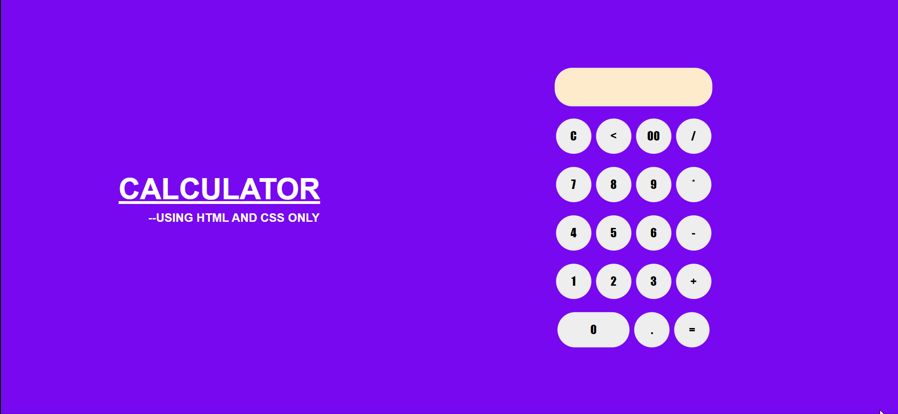

# Calculator-using-HTML-and-CSS-only
Creating calculator by using HTML and CSS only

After going through this project, you will be able to develop your own calculator using HTML and CSS only, without any help of JS. By using simple HTML tags like <form>, <input> etc. and some other in-built HTML functions along with a touch of CSS, this project can be successfully completed.

This is the final output you will get after the completion of this project

